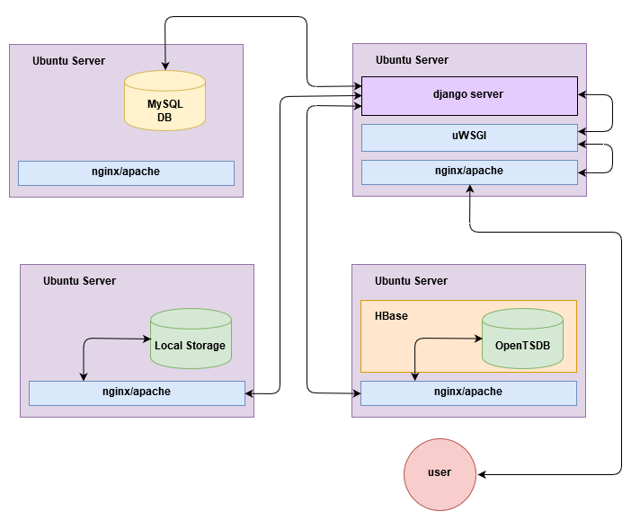

SKVO docs
=========

SKVO is a portal gathering processed photometry observation, obtained by couple of different facilities, organisations
and instruments. The main idea is to make those data accessible to others.

Behind the scene
~~~~~~~~~~~~~~~~

Behind the scene of SKVO is hidden several different technologies that make it works.
SKVO consist of the following main parts::
    
    - Ubuntu 16.04 server
    - Python DJango server
    - Apache/NGINX server
    - MySQL database
    - HBase databsae
    - OpenTSDB database

Bellow is the architecture of used components

Just beware it is not a fixed model, any combinations of block separeated on the different ubuntu server can be joined,
depends on performance demands.

Observation data are stored in couple of different locations, depends on data types. Media (images) are stored
somewhere on local storage, timeseries data are stored in OpenTSDB and best storage
we find out for metadata is MySQL database.

Photometry
~~~~~~~~~~
Data comming from photometric observations consist of three different types and has to be stored in three different
locations in some way linked to each other. Observation data consist from the following types:

    - images: processed raw images, converted to one of the following types, and so ``png`` or ``jpeg/jpg``

      (consider do not support jpeg, just png)
    - metadata: information where the observation and source data are comming from
    - observation data: processed time series data that represents each point of observation

Media (iamges)
--------------

Media (images) are data representing real images comming from observation. We are not providing raw images, but
processed. Its mean, raw images taken by the camera are converted to ``png`` format.
Those data are not supposed to compensate observation timeseries data since their quality is donwscalled.
The main reason to store those data is give information to user, where points in OpenTSDB are coming from.

(in the first version, images don't be even exposed to enduser and their will be for internal purposses)

Metadata
--------

Metadata contain a lot of usefull additional informations thaht cannot be stored as time series data. You might found
there a place, where data come from, organisation providing data, instrument that data have been taken, etc.

Example of metadata content is shown bellow::

    [
        {
            "observation": {
                "id": 1,
                "access": {
                    "id": 1,
                    "access": "open"
                },
                "target": {
                    "id": 1,
                    "target": "bet_Lyr",
                    "catalogue": "default",
                    "catalogue_value": "bet_Lyr",
                    "description": "bet_Lyr description",
                    "right_ascension": "18.5000000000",
                    "declination": "33.2100000000",
                    "equinox": "J2000",
                    "target_class": "variable"
                },
                "instrument": {
                    "id": 1,
                    "instrument": "instrument.uvw",
                    "instrument_hash": "f104c9851b3d5efc373eafd49db9ffca",
                    "telescope": "instrument.telescope.uvw",
                    "camera": "instrument.camera.uvw",
                    "spectroscope": "instrument.spect.uvw",
                    "field_of_view": "10.0000000000",
                    "description": "instrument.description"
                },
                "facility": {
                    "id": 1,
                    "facility": "facility.in.upjs",
                    "facility_uid": "uid.facility.upjs",
                    "description": "facility.description.upjs"
                },
                "dataid": {
                    "id": 1,
                    "organisation": {
                        "id": 1,
                        "organisation": "organisation.upjs",
                        "organisation_did": "http://organisation.did.upjs",
                        "email": "upjs@upjs.com"
                    },
                    "source": "upjs",
                    "title": "title.upjs",
                    "publisher": "publisher.upjs",
                    "publisher_did": "http://publisher_did.upjs"
                },
                "observation_hash": "43dc67129bf0c6e2318c0cedc90aa97d"
            },
            "bandpass": {
                "id": 1,
                "bandpass": "band.johnson.u",
                "bandpass_uid": "johnson.u",
                "spectral_band_type": "optical",
                "photometric_system": "sys"
            },
            "media": "upjs::os.sep::photometry::os.sep::media::os.sep::201712::os.sep::bet_Lyr_20171204::os.sep::johnson.u",
            "start_date": "2017-12-04T00:00:01Z",
            "end_date": "2017-12-04T00:00:15Z"
        }
        ...
    ]

Those data are stored in MySQL database in several differend tables linked to each other by ``foreign keys``.
Each of the table is deffined by the following python classes as object realted object (ORM)::

    BANDPASS_SPECTRAL_BEND_TYPES = [
        ('radio', 'radio'),
        ('millimeter', 'millimeter'),
        ('infrared', 'infrared'),
        ('optical', 'optical'),
        ('ultraviolet', 'ultraviolet'),
        ('xray', 'xray'),
        ('gammaray', 'gammaray')
    ]

    DTYPES = [("photometry", "photometry"), ("spectroscopy", "spectroscopy")]
    ACCESS_RIGHT = [("open", "open"), ("on_demand", "on_demand"), ("restricted", "restricted")]

    class Target(models.Model):
        target = models.CharField(max_length=128, null=False)
        catalogue = models.CharField(max_length=128, null=False)
        catalogue_value = models.CharField(max_length=128, null=False)
        description = models.CharField(max_length=128, null=True)
        right_ascension = models.DecimalField(max_digits=20, decimal_places=10, null=False)
        declination = models.DecimalField(max_digits=20, decimal_places=10, null=False)
        equinox = models.CharField(max_length=64, null=False)
        target_class = models.CharField(max_length=128, null=True)
        created = models.DateTimeField(auto_now_add=True)

        class Meta:
            unique_together = ('catalogue', 'catalogue_value')

    class Bandpass(models.Model):
        bandpass = models.CharField(max_length=32, null=False)
        bandpass_uid = models.CharField(max_length=32, null=False, unique=True)
        spectral_band_type = models.CharField(choices=BANDPASS_SPECTRAL_BEND_TYPES, null=False, max_length=64)
        photometric_system = models.CharField(max_length=32, null=False)
        created = models.DateTimeField(auto_now_add=True)

    class Instrument(models.Model):
        instrument = models.CharField(max_length=64, null=False)
        instrument_hash = models.CharField(max_length=64, null=False, unique=True)
        telescope = models.CharField(max_length=64, null=False)
        camera = models.CharField(max_length=64, null=True, default=None)
        spectroscope = models.CharField(max_length=64, null=True, default=None)
        field_of_view = models.DecimalField(max_digits=20, decimal_places=10, null=False)
        description = models.CharField(max_length=256, null=True)
        created = models.DateTimeField(auto_now_add=True)

    class Facility(models.Model):
        facility = models.CharField(max_length=128, null=False)
        facility_uid = models.CharField(max_length=128, null=False, unique=True)
        description = models.CharField(max_length=256, null=True)
        created = models.DateTimeField(auto_now_add=True)

    class Organisation(models.Model):
        organisation = models.CharField(max_length=128, null=False)
        organisation_did = models.CharField(max_length=128, null=False, unique=True)
        email = models.EmailField(max_length=128, null=False)
        created = models.DateTimeField(auto_now_add=True)

    class AccessRights(models.Model):
        access = models.CharField(choices=ACCESS_RIGHT, null=False, max_length=32, unique=True)
        created = models.DateTimeField(auto_now_add=True)

    class DataId(models.Model):
        source = models.CharField(max_length=32, null=False)
        title = models.CharField(max_length=32, null=False)
        publisher = models.CharField(max_length=128, null=False)
        publisher_did = models.CharField(max_length=128, null=False)
        organisation = models.ForeignKey(to=Organisation, on_delete=models.PROTECT)
        created = models.DateTimeField(auto_now_add=True)

    class Observation(models.Model):
        observation_hash = models.CharField(max_length=128, null=False, unique=True)
        access = models.ForeignKey(to=AccessRights, on_delete=models.PROTECT)
        target = models.ForeignKey(to=Target, on_delete=models.PROTECT)
        instrument = models.ForeignKey(to=Instrument, on_delete=models.PROTECT)
        facility = models.ForeignKey(to=Facility, on_delete=models.PROTECT)
        dataid = models.ForeignKey(to=DataId, on_delete=models.PROTECT)
        created = models.DateTimeField(auto_now_add=True)

    class Photometry(models.Model):
        observation = models.ForeignKey(to=Observation, on_delete=models.PROTECT)
        bandpass = models.ForeignKey(to=Bandpass, on_delete=models.PROTECT)
        media = models.CharField(max_length=256, null=False)
        start_date = models.DateTimeField()
        end_date = models.DateTimeField()
        created = models.DateTimeField(auto_now_add=True)

    class Spectroscopy(models.Model):
        observation = models.ForeignKey(to=Observation, on_delete=models.PROTECT)
        media = models.CharField(max_length=256, null=False)
        start_date = models.DateTimeField()
        end_date = models.DateTimeField()
        created = models.DateTimeField(auto_now_add=True)

Uploading process will craete json in required format and ``POST`` it to the running endpoint ``/api/photometry/metadata/``.
On the backend, there is checked which of the incomming model objects already contain desired information and in such case
won't be craeted and on the other side, data which are not stored in database will be created on fly. In case,
new observation is created, unique ``hash`` based on all metadata is assigned to this record.
This hash is intended to separate observation based on days.
Hash is computed as ``md5`` from string created as metadata joined with ``___``. Order is based on name of columnes, since
columns of dataframe are sorted. Exact order of columns is as following::

    start_date

    access.access
    bandpass.bandpass
    bandpass.bandpass_uid
    bandpass.photometric_system
    bandpass.spectral_band_type
    dataid.publisher
    dataid.publisher_did
    dataid.title
    facility.description
    facility.facility
    facility.facility_uid
    instrument.camera
    instrument.description
    instrument.field_of_view
    instrument.instrument
    instrument.spectroscope
    instrument.telescope
    organisation.email
    organisation.organisation
    organisation.organisation_did
    target.catalogue
    target.catalogue_value
    target.declination
    target.description
    target.equinox
    target.right_ascension
    target.target
    target.target_class

On the begining of the string, start date in form ``'YYYYMMDD`` is used as salt.

On fly, there is generated also observation id,
as primary key for ``observation`` model table and works as foreign key for time series
(observation points, errors and exposure) data stored in OpenTSDB.

Response also contain an ``instrument hash``. That hash is used in timeseries data as tag value of instrument
key and it is computed as as ``md5`` from follwoing values ``instrument``, ``telescope``, ``camera``, ``spectroscope``
and ``field_of_view`` in the mentioned order each separated by ``___``.

Important notes:
    - right ascension have to be passed as positive value; in case you will pass a negative value, it will cause
      a lookup problem and you won't be ale to find it

Observation (time series) data:
-------------------------------

Observation data basically consist of ``magnitude``, ``related timestamp``, ``error``, ``exposure`` and so forth.
Those data will be stored in OpenTSDB. OpenTSDB is **nosql** database engine running on top of HBase nosql database.
OpenTSDB was designed to store time series and subsequently provide efficient way to access them. Data are stored under
the key called metric. Each of the metric can carre couple of additional information. Those informations are
stored in pairs ``key: value`` and we call them a **tags**. For more information visit `OpenTSDB website <http://opentsdb.net/>`_

Observationd data, from the OpenTSDB point of view, can be splited to three different groups. Basically we will create
a different metrics carring a necessary informations about ``magnitudes``, ``magnitude errors`` and ``exposure``.
The fourth additional metric is neccesery to store and link information to metadata saved in MySQL database.

**Magnitude** for given target object is stored in metric **<target_uid>.<bandpass_uid>.photometry.<version>**, where
``target_uid`` is a unique identfier for target object, ``bandpas_uid`` is a unique identifier for bandpass used during
observation nad ``version`` represent our internal sign for version of data. Those information are choosen by service
provider or data provider during upload process. Basically they have to be stored in files given for upload.
A given metric also contain a couple of tags, and so ``instrument``, ``target``, ``source``, ``flux_calibration_level``,
``flux_calibration` and ``timeframe_reference_position``

The meaning of each mentioned quantities is as following::
    - ``instrument``: value is a hash computed as described in part about `Metadata`_
    - ``target``: target is unique identifier for observation object; all non alphanumerical and non undersocres are HEXa encoded
    - ``source``: source carre an information about dataset, data are comming from (e.g. upjs, vhao, etc.); value cannot contain non alphanumerical characters; since in this case, encoding to HEXa is not provided
    - ``flux_calibration_level``: this quantity contain an information how good is observation point stored for given metric and timestamp; value have to be an integer; higher value denotate a better quality
    - ``flux_calibration``: this tells us whether stored magnitude value represent a absolute magnitude (``abs``) or differential magnitude (``dif``)
    - ``timeframe_reference_position``: and finally timeframe_reference_position, has an information about time reference position of timestamp value

Just beware, timestamp value under point is stored is unix timestamp, not a Julian date as usually used in astronomy

An exmaple of http import json for OpenTSDB API is following::

    [
        {
            'metric': beta-20Lyr.jonsonU.photometry.v0
            'timestamp': 14038548000
            'value': 12.0,
            'tags':
                {
                    'instrument': ziga.specterX.buda,
                    'target': bet-20Lyr,
                    'source': upjs,
                    'flux_calibration_level': 1,
                    'flux_calibration': abs,
                    "timeframe_reference_position": barycenter
                }
        }
    ]

You probably noticed ``-20`` in metric name. OpenTSDB metric allows just specific symbols to be in metric name, so we are encoding
all other symbols to HEX code for given symbol with leading ``-``.

**Magnitude error** for given timestamp and magnitude is stored in similar way as mmagnitude itself. We are using a metric
**<target_uid>.<bandpass_uid>.error.photometry.<version>** with following OpenTSDB tags, and so ``instrument``, ``target`` and ``source``.
Meaning of the used tags is same as in case of observation data.

An example of the json form of metric requred for update to OpenTSDB is::

    [
        {
            'metric': beta-20Lyr.jonsonU.error.photometry.v0
            'timestamp': 14038548000
            'value': 0.1,
            'tags':
                {
                    'instrument': ziga.specterX.buda,
                    'target': bet-20Lyr,
                    'source': upjs,
                }
        }
    ]

**Exposure** is stored in the same way as magnitude error, just under different metric name, **<target_uid>.<bandpass_uid>.exposure.photometry.<version>**
and example is bellow::

    [
        {
            'metric': beta-20Lyr.jonsonU.exposure.photometry.v0
            'timestamp': 14038548000
            'value': 60,
            'tags':
                {
                    'instrument': ziga.specterX.buda,
                    'target': bet-20Lyr,
                    'source': upjs,
                }
        }
    ]

Finally, there is a one more metrics puting together all previous with related metadata in MySQL database. Used metric is
**<target_uid>.<bandpass_uid>.oid.photometry.<version>** and all values stored in this metric are just the same ``observation_id``
from database. This value is latter used as a foreign key for relation database.

Upload data flow
~~~~~~~~~~~~~~~~

All data processing from local data to metadata opentsdb data and media can be provided automatically by created script.
To be able use an upload script, like following data structure has to be provided::

    data
        `- source
                 `- dtype
                         `- imgs
                         |      `- yyyymm
                         |               `- objectuid_yyyymmdd [datetime when observation starts]
                         |                                    `- bandpass_uid
                         |                                                  `- objectuid_yyyymmdd_id.jpeg/png/whatever
                         `- dtables
                                   `- yyyymm
                                            `- objectuid_yyyymmdd [datetime when observation starts]
                                                                  `- bandpass_uid
                                                                                `- objectuid_yyyymmdd_data_id.csv [observation data]
                                                                                `- objectuid_yyyymmdd_meta_id.csv [metaddata]

Uploader script rely on mentioned data structure.
``data`` path on the top of sctruct tree is defined in ``skvo.ini`` configuration file as ``base_path``.
Concrete structure should looks like following one::

    data
        `- upjs
                `- photometry
                            `- imgs
                            |      `- 201802
                            |               `- bet_Lyr_20180217
                            |                                  `- Jonson.U
                            |                                             `- bet_Lyr_20180217_0.png
                            |                                             `- bet_Lyr_20180217_1.png
                            |                                             `- bet_Lyr_20180217_2.png
                            `- dtables
                                       `- 201802
                                                `- bet_Lyr_20180217
                                                                   `- Jonson.U
                                                                              `- bet_Lyr_20180217_data_id.csv
                                                                              `- bet_Lyr_20180217_meta_id.csv

      
During a runtime of the uploader script, following procedures are executed.
First, for given source (institution, facility, whatever you wish), observation target and bandpass,
metadata and observation data tables are loaded as pandas dataframes.

Here is an example of headers and data line from metadata table (<taget_uuid>_<YYYYMMDD>_meta.csv).

Header::

    arget.target,target.catalogue,target.catalogue_value,target.description,target.right_ascension,target.declination,target.target_class,bandpass.bandpass,bandpass.bandpass_uid,bandpass.spectral_band_type,bandpass.photometric_system,instrument.instrument,instrument.instrument_uid,instrument.telescope,instrument.camera,instrument.spectroscope,instrument.field_of_view,instrument.description,facility.facility,facility.facility_uid,facility.description,organisation.organisation,organisation.organisation_did,organisation.email,dataid.title,dataid.publisher,dataid.publisher_did,access.access

Data::

    bet_Lyr,default,bet_Lyr,bet_Lyr description,18.5,33.21,variable,band.johnson.u,johnson.u,optical,sys,instrument.uvw,instrument.uid.uvw,instrument.telescope.uvw,instrument.camera.uvw,instrument.spect.uvw,15,instrument.description,facility.in.upjs,uid.facility.upjs,facility.description.upjs,organisation.upjs,http://organisation.did.upjs,upjs@upjs.com,title.upjs,publisher.upjs,http://publisher_did.upjs,open

Bellow is an example of header and data line of observation data table <taget_uuid>_<YYYYMMDD>_data.csv

Header::

    ts.timestamp,ts.magnitude,ts.magnitude_error,ts.flux_calibration,ts.flux_calibration_level,ts.exposure,ts.timeframe_reference_position

Data::

    2017-12-04 00:00:11,0.25,0.07692307692307693,abs,2,12,heliocenter

You **have to**  follow naming convention, otherwise uploader script won't work. Transformation function from dataframe
to tsdb metrics and metadata json rely on the mentioned convention.

You have probably noticed, that data in tables are represented as and real comma separated values, so, just use real csv,
not any decimal position same margin files or any different similar bullshits.

When data are loaded to memory, from the given informations a metadata json is created. An exmaple of metadata json is shown above
in section `Metadata`_ . Created metadata json is 'POSTed' on listening endpoint of SKVO Django server, and so ``/api/photometry/metadata/``.
This endpoint will return a response based on serializer which contain generated uuid4 of observation and databsae observation id.
The observation id is used in observation id metrics which are linkin database metadata and other observation OpenTSDB metrics.
Mentioned endpoint allows only POST method and has to be authenticated with correct ``username`` and ``password`` sent in
header as ``headers={"username": "user", "password": "****"}``

Now observation data are processed. It is mean, all necessary metrics described in `Observation (time series) data:`_ are created.
Basically, pandas dataframes are converted to the python list of dicts shown above, no big deal. Finally, all created metrics are
'POSTed' by ``pyopentsdb`` python library on the OpenTSDB HTTP API endpoint, ``/api/put/``.
    

At the end, just media left. For given observation, each image file is read from local storage as raw object and with couple of
additional metadta is serialized to the following schema::

    {
        "content": <raw_image_content>,
        "filename": <filename>,
        "target": <target>,
        "md5_crc": <md5_crc>,
        "source": <source>,
        "bandpass": <bandpass>,
        "start_date": <datetime_of_first_observation_point>
    }

Raw content is GZIPed before operation of serialisation and md5 CRC sum is computet from gziped object. Such schema is converted to
**avro** binary and this bytes like object is POSTed to endpoint ``/api/photometry/media/`` where avro is decoded and file is stored.
Mentioned endpoint allows only POST method and has to be authenticated with correct ``username`` and ``password`` sent in
header as ``headers={"username": "user", "password": "****"}``

Serialized informations are encoded to avro, based on the following schema::

    {
        "namespace": "skvo.types",
        "name": "PhotometryMediaDataContainer",
        "type": "record",
        "fields": [
            {
                "name": "content",
                "type": "bytes"
            },
            {
                "name": "filename",
                "type": "string"
            },
            {
                "name": "md5_crc",
                "type": "string"
            },
            {
                "name": "source",
                "type": "string"
            },
            {
                "name": "bandpass",
                "type": "string"
            },
            {
                "name": "target",
                "type": "string"
            },
            {
                "name": "start_date",
                "type": "string"
            }
        ]
    }

Local storage structure on the remote server is almost the same as on the storage data are coming from, and so::

    data
        `- source
                 `- dtype
                         `- imgs
                                `- yyyymm
                                         `- objectuid_yyyymmdd [datetime when observation starts]
                                                              `- bandpass_uid
                                                                            `- objectuid_yyyymmdd_id___unixtimestamp.jpeg/png/whatever

where ``data`` path is specified in ``skvo.ini`` config file as ``export_path``, of course, on the server side.

Main difference against a local storage, where data are comming from is in a filename. There is added an unix
timestamp in name of file, since in time series **sub** set, we can loose information, which file belongs
to which observation observation point. During upload process, timestamp is obtained from dataframe based
on the index in filename. Just beware, in case, there is any inconsistency between data table and order
of ids in filename of image, wrong timestamp will be assigned to image filename. Number and order of images have to match
order and number of datapoints in csv data table.

Lookup
~~~~~~

SKVO providing an endpoint for searching observations defined by given combination of the following parameters:

    - dataset - define a datasets/source, it means, you can lookup the data for the specific source (e.g. upjs, vhao, etc.)
    - ra - right ascension of central point to starts lookup
    - de - declination of central point to starts lookup
    - target - target is another way, how to specify a central point; right ascension and declination is resolved
               on the backend; in case, ``ra`` and ``de`` are provided, coordinates of target are ignored

    - box_size_ra - box size in degrees of right ascension to search in
    - box_size_de - box size in degrees of declination  to search in

Lookup endpoint is ``/api/photometry/lookup/`` and it accepts ``POST`` method. An example of JSON acceptable by this endpoint is::

    {
        "dataset": "upjs",
        "ra": 10,
        "de": 15,
        "box_size_ra": 30,
        "box_size_de": 10
    }

or::

    {
        "dataset": "upjs",
        "target": "bet_lyr",
        "box_size_ra": 30,
        "box_size_de": 10
    }

When any match is found, response looks similar to this one::

    [
         {
            "start_date": "2018-01-02T00:00:01Z",
            "end_date": "2018-01-02T00:00:15Z",
            "observation": {
                "id": 7,
                "observation_hash": "cf577bcad557cac7900f331b53e84d58"
            },
            "instrument": {
                "id": 3,
                "instrument": "instrument.uvw",
                "instrument_hash": "bf17e6e4055f80213bbfb4338d28e790",
                "telescope": "instrument.telescope.uvw",
                "camera": "instrument.camera.uvw",
                "spectroscope": "instrument.spect.uvw",
                "field_of_view": 12.0,
                "description": "instrument.description"
            },
            "dataid": {
                "id": 1,
                "source": "upjs",
                "title": "title.upjs",
                "publisher": "publisher.upjs",
                "publisher_did": "http://publisher_did.upjs",
                "organisation": 1
            },
            "organisation": {
                "id": 1,
                "organisation": "organisation.upjs",
                "organisation_did": "http://organisation.did.upjs",
                "email": "upjs@upjs.com"
            },
            "facility": {
                "id": 1,
                "facility": "facility.in.upjs",
                "facility_uid": "uid.facility.upjs",
                "description": "facility.description.upjs"
            },
            "access_rights": {
                "id": 1,
                "access": "open"
            },
            "target": {
                "id": 1,
                "target": "bet_Lyr",
                "catalogue": "default",
                "catalogue_value": "bet_Lyr",
                "description": "bet_Lyr description",
                "right_ascension": 18.5,
                "declination": 33.21,
                "equinox": "J2000",
                "target_class": "variable"
            },
            "bandpass": {
                "id": 1,
                "bandpass": "band.johnson.u",
                "bandpass_uid": "johnson.u",
                "spectral_band_type": "optical",
                "photometric_system": "sys"
            },
            "samples": 14
        },
        ...
    ]

There is also a posibility to use method GET. In such case, it is necessary to distinguish if you want to use ``target``
or coordinates. In case, you want to use target, then url is pecified in following way::

    /api/photometry/lookup/dataset/<dataset_value: string>/target/<target_value: string>/box_size_ra/<box_size_ra_value: float>/box_size_de/<box_size_de_value: float>/

Important notes:
    - do not forget trailing slash

Parameter ``dataset``, ``box_size_ra`` and ``box_size_de`` are optional and can be ommited. In such case, also get rid of
prefix in url like ``/dataset/`` or ``/box_size_ra/``.

Similar behaviour is also in case if you want to use a coordinates instead of target. Then, url looks like this::

    /api/photometry/lookup/dataset/<dataset_value: string>/ra/<ra_value: float>/de/<de_value: float>/box_size_ra/<box_size_ra_value: float>/box_size_de/<box_size_de_value: float>/

Access reference
~~~~~~~~~~~~~~~~

Way to obtain data is hit endpoint ``/api/photometry/aref/`` by POST method with specified JSON. Informations to fill up
an access reference JSON have to be obtainied from lookup mentioned in `Lookup`_
Structure of ``aref`` JSON is like this one::

    {
        "start_date": <string: YYYY-MM-DD HH:MM:SS>,
        "end_date": <string: YYYY-MM-DD HH:MM:SS>,
        "observation": {
            "id": <integer>
        },
        "instrument": {
            "instrument_hash": <string>
        },
        "target": {
            "catalogue_value": <string>
        },
        "bandpass": {
            "bandpass_uid": <string>,
        },
        "dataid": {
            "source": <string>
        }
    }

Concrete example is bellow::

    {
        "start_date": "2017-12-04 00:00:01",
        "end_date": "2017-12-04 00:00:15",
        "observation": {
            "id": 1
        },
        "instrument": {
            "instrument_hash": "f104c9851b3d5efc373eafd49db9ffca"
        },
        "target": {
            "catalogue_value": "bet_Lyr"
        },
        "bandpass": {
            "bandpass_uid": "johnson.u"
        },
        "dataid": {
            "source": "upjs"
        }
    }

In current version, there is not accepted ``many`` input.
Response of endpoint is like following::

    add response
